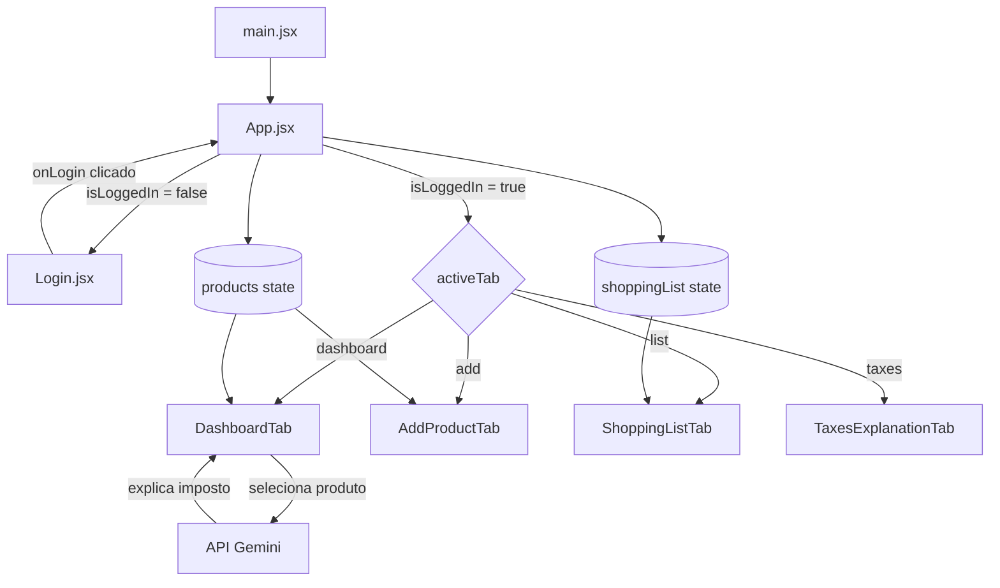

# 🏗️ Arquitetura do Projeto

## 🎥 Demonstração: Navegação e Temas Dinâmicos


---

## Estrutura de Pastas

```
meu-indice/
├── docs/                      ← Documentação (você está aqui)
│   ├── README.md
│   ├── arquitetura.md
│   ├── componentes.md
│   ├── dados.md
│   ├── features.md
│   └── api-gemini.md
├── public/
├── src/
│   ├── assets/                ← Imagens e ícones estáticos
│   ├── App.jsx                ← Componente raiz + todos os módulos de aba
│   ├── Login.jsx              ← Tela de login simulado (Google)
│   ├── TaxesExplanationTab.jsx← Aba educativa de impostos
│   ├── index.css              ← Estilos globais + animações CSS
│   ├── main.jsx               ← Entry point do React
│   └── initialProducts.json  ← Dados iniciais (gerado do CSV)
├── index.html
├── vite.config.js
├── package.json
└── .gitignore
```

---

## Fluxo de Dados



---

## Estado Global (`App.jsx`)

O componente `App` é o único detentor do estado global da aplicação. Todos os sub-componentes são funções definidas **dentro** do `App`, tendo acesso direto ao state via closure — sem Context API ou Redux.

| Estado | Tipo | Descrição |
|--------|------|-----------|
| `isLoggedIn` | `boolean` | Controla se o usuário passou pela tela de login |
| `activeTab` | `string` | Aba ativa: `'dashboard'`, `'add'`, `'list'`, `'taxes'` |
| `products` | `Product[]` | Array completo de produtos carregados |
| `shoppingList` | `ShoppingItem[]` | Itens adicionados à lista de compras |

---

## Decisões de Design

### Componentes "dentro" do App
Os componentes internos (`Header`, `Navigation`, `DashboardTab`, `AddProductTab`, `ShoppingListTab`) são **funções declaradas dentro de `App()`**. Isso permite que eles acessem o state e handlers sem prop drilling, mas significa que eles são recriados a cada render do App.

### Sem roteador
A navegação entre abas usa apenas um `activeTab` state — **sem React Router**. Isso mantém a aplicação simples (SPA sem URLs distintas por aba).

### Tema via objeto JavaScript
Os temas dinâmicos por aba são definidos como um objeto `appThemes` com classes Tailwind como strings, selecionadas por `appThemes[activeTab]`. Essa abordagem é simples e não requer Context nem CSS variables.

### API Gemini sem backend
A chave da API Gemini é inserida diretamente no frontend (`const apiKey = "..."`). Em produção, isso deveria ser movido para um proxy backend — mas para o escopo deste protótipo, é aceitável.
