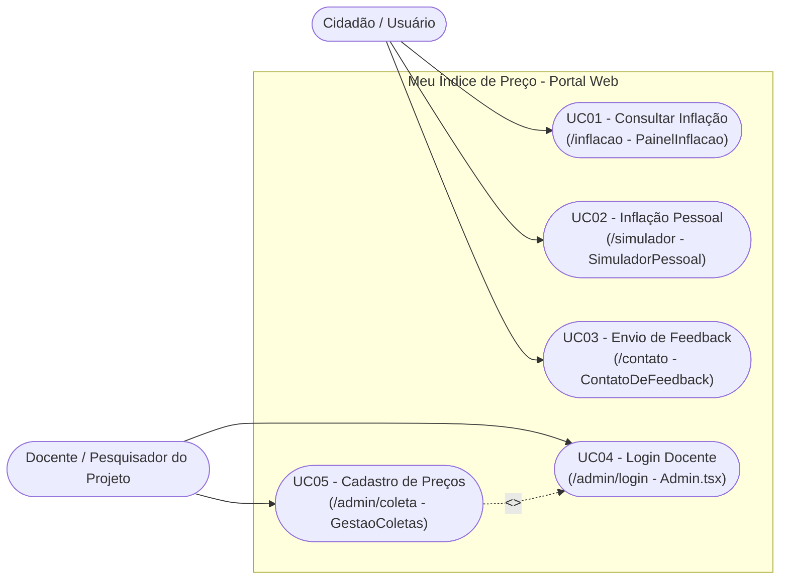
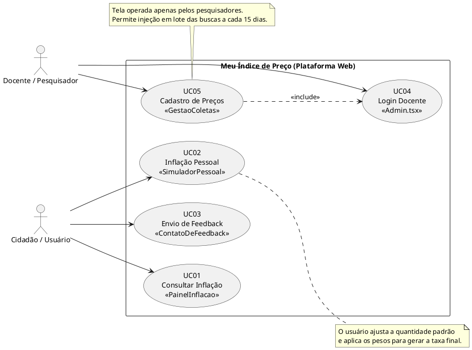

# Diagrama de Casos de Uso - Relacionamento com Interface de Usuário (IU)

Este documento apresenta o diagrama de casos de uso do sistema **Meu Índice de Preço**, mapeando as funcionalidades com seus respectivos componentes visuais e rotas do frontend.

Refere-se à plataforma web para acompanhamento da inflação local em Morrinhos-GO, contemplando as áreas públicas e a área administrativa.

## Diagrama Visual (Mermaid)

O diagrama abaixo utiliza `mermaid` (renderizado nativamente no GitHub e em editores compatíveis):

---

## Código PlantUML

Para ferramentas que suportam **PlantUML**, o código abaixo gera o diagrama de uso formal completo:

## Tabela de Relacionamento IU com Casos de Uso

| Caso de Uso Principal | Interface (Path/Component) | Descrição do Fluxo |
| :--- | :--- | :--- |
| **UC01 - Consultar Inflação** | `/inflacao` (`PainelInflacao`) | Página pública inicial para leitura. Renderiza gráficos estáticos das 30 mercadorias avaliadas em Morrinhos. |
| **UC02 - Inflação Pessoal** | `/simulador` (`SimuladorPessoal`) | Calculadora dinâmica. O usuário ajusta a quantidade padrão e aplica os pesos para gerar a taxa final para si. |
| **UC03 - Envio de Feedback** | `/contato` (`ContatoDeFeedback`) | Formulário acessível onde os usuários da comunidade reportam problemas ou relatam uso prático. |
| **UC04 - Login Docente** | `/admin/login` (`Admin.tsx`) | Barreira de proteção SSL para autenticação e gestão. |
| **UC05 - Cadastro de Preços** | `/admin/coleta` (`GestaoColetas`) | Tela operada apenas pelos pesquisadores. Permite injeção em lote das buscas a cada 15 dias. |
